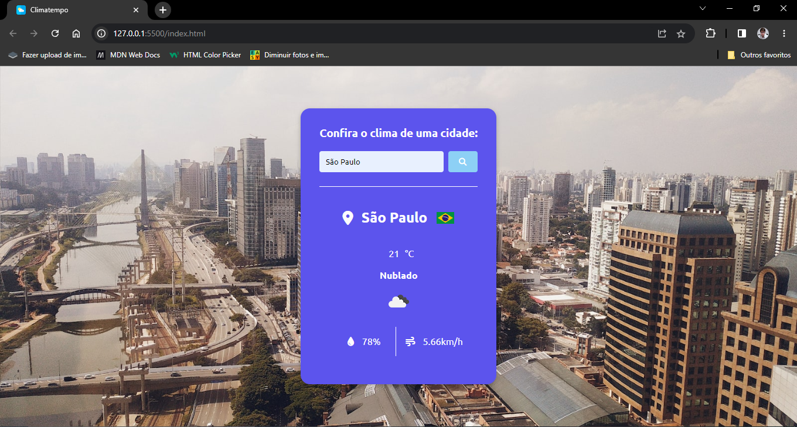

<h1 align = "center"> Olá, seja bem-vindo ao meu projeto </h1>
 
<h2 align = "center"> Este é um Weather App feito com JavaScript e mais três APIs para incrementá-lo</h2>
 

 Neste climatempo, ao digitar o nome da cidade da qual deseja saber o clima, além das métricas meteorológicas padrões como a temperatura, umidade, velocidade do ar etc, dados dos quais são fornecidos pela API da OpenWeatherMap, a API Unsplash fornece um background relativo a cidade pesquisada e a API FlagsAPI fornece a bandeira do país relativo a cidade pesquisada. 

 

 Abaixo você poderá ver algumas prints do projeto.

 
<h3 align = "center"> Weather App</h3>
 

 
<h3 align = "center"> Alguns exemplos de pesquisa de cidades pelo mundo</h3>
 

 

 

 
<h3 align = "center"> Erro fornecido ao pesquisar uma cidade inválida</h3>
 

